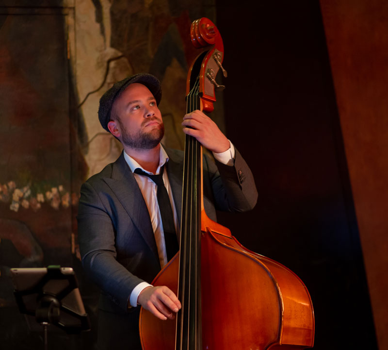

## Music

Making music started at the age of fifteen and quickly grew into my greatest passion. 
As a bass player I always play in the service of the music and the group in which 
I play. I think that's the best thing: when we can make music together that touches 
people. And that arises when the group trusts one another and everyone is willing to 
put his or her ego aside.

I play bass guitar and double bass in the following formations:

- [SOULID!](https://www.soulid.nu) – Soul/pop band
- [Neil Diamond Memories band](https://www.neildiamondmemories.com/) – De Nederlandse Neil Diamond Tribute band
- [Me and the Martians](https://www.meandthemartians.com/) – Eigen werk band

> I have known Joris since 2006 as a very passionate and musical bass player.
> The word "No" is not in his vocabulary, he is up for anything.
> Whether it concerns a small background performance with double bass in a
> trio or quartet formation, or as a bassist in a theater performance
> (such as TOON: Liedjesman), as a co-composer/arranger in a singer-songwriter
> band (Me & the Martians), or to lay a solid foundation under an 11-piece cover band,
> he is at home in all markets. He has been my go-to bassist for years.
>
>
> **Harrie Autumn, Musical director TOON: Liedjesman, composer / arranger / pianist.**

### Experience
I have been playing in various bands and projects since 2000. 
I started playing electric guitar when I was fifteen. Two years later I started 
playing bass guitar. I played both instruments for about ten years. 
In 2007 double bass was added. I have a lot of experience reading music through 
the many musical projects and big bands. I took lessons from Frank Mommers and 
Ratko Zjaca on guitar, and from Berry Jansen on bass guitar. In addition, 
I went to the Warwick bass camp in 2014, where I followed masterclasses from 
Victor Wooten, Armand Sabal-Lecco and Victor Bailey, among others.

I have played in:

- Soul/funk/pop bands
- Big bands
- Jazz combos
- Musical theater projects
- Theater productions
- Reggae bands

> I have known Joris Heus for about 15 years and we got to know each other through music. 
> First as a talented guitarist during musicals and various big bands and later as a very 
> good and skilled bass player. After doing our own projects for a few years, Joris and 
> I have been playing together in the band SOULID for about 5 years now!
> 
> It is very nice to work with Joris. He has his affairs in order; always prepare well, 
> work extremely hard both musically and organizationally and last but not least… you can 
> always count on him! There are few people as committed as he is. Moreover, this strong 
> commitment is always accompanied by a cheerful and positive attitude.
> 
> As a musician he adapts to what is best for the end result at that moment. 
> This makes him very versatile as a musician. He can act very subservient to the greater 
> whole, for example in the theater during an underscore for a scene or grooving when a 
> fellow musician has a solo, but he can also certainly seize his moment in a solo or 
> as a driving bass player in a so(u ) member laying foundation!
> 
> 
> **Roos van Breukelen, Singer, Actress & Theater Maker.**